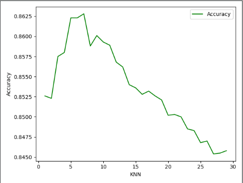
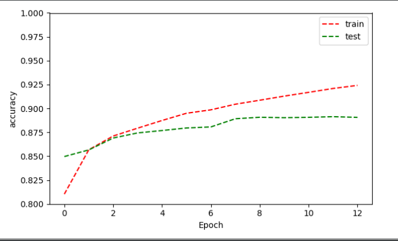

# MSiD4 Michał Chrobot

## Introduction

Fashion-MNIST problem is one of the problems solved with the use of machine learning methods.

Fashion-MNIST is a collection of data on photos of Zalando fashion articles - consisting of a training set of 60,000 examples and a test set of 10,000 examples. 
Each example is a 28x28 grayscale image, associated with a label from 10 classes describing the category of the photo.

The purpose of the task is to implement a model that will allow the classification of thumbnails of photos representing clothes
i.e. identifying a number that determines what category the object belongs to based on the image used
different machine learning models, comparing their results with the results of similar algorithms in the section
http://fashion-mnist.s3-website.eu-central-1.amazonaws.com/ and trying to get the best model

The basic problem and its description on which I was based can be found at:
https://github.com/zalandoresearch/fashion-mnist

## Methods

### KNN

The first method I used to solve this problem is the method of k-nearest-neighbors (KNN).
This is a discriminatory model aimed at modeling conditional distribution.

For a given function, the probability distribution of a class is estimated on the condition of the features
in a non-parametric manner using the class values for κ ∈ N of the nearest objects.
 
The program that implements this approach is here [rozwiązanie KNN](Fashion_MNIST_KNN.py)

Test and training data were downloaded from https://github.com/zalandoresearch/fashion-mnist
at first I load them and set the range of tested k from 1 to 29.

After running the program, the first operation performed is calculating the Manhattan distance
to determine the distance of test data (whose labels we are to specify) from training data
(whose labels do we know).
    
Then, based on the calculated distances, the labels are sorted and the probability of 
belonging a given image to each category based on sorted labels and given number of neighbors is calculated.
    
Finally, a classification error is calculated (average telling in which % of cases the program will not predict
label correctly)
 
The chart of the correctness of the classification depending on the size k is as follows:

### MLP

The second method I used is the neural network.
At the network input it adopts the softmax function so MLP is treated as a probabilistic discriminatory model.
The program that implements this approach is here [rozwiązanie MLP](Fashion_MNIST_MLP.py)

##### Data preparation:
When creating this network, I used the TensorFlow library, data is downloaded the same way as in the program
using the KNN algorithm, however, the values of individual pixels are scaled to the range of 0-1 in order to
facilitate the network operating on them.

Our goal is to predict the probability for each of the 10 classes so in order to better prepare our labels, 
we write the value of each in the form of an array where the value 1 is assigned to it index, 
which indicates the value of the label.
This means that if the label 6 was written in y [0], it is now
y [0] = [0., 0., 0., 0., 0., 1., 0., 0., 0., 0.,]. This method is called "One Hot"

##### Architecture:
The program uses the sequential interface in the Keras model, the input will be given data in the form of an array of
784 pieces.

Hidden layers consist of 512, 256 and 128 neurons and the ReLU activation function (this function returns max (0, x))
(if the sum of the weighted elements entering the neuron is greater than 0 then the activation function simply returns this value.) 
For negative values, the ReLU function returns 0). A dense layer is used for which all units of the previous layer are combined 
with all the ones in the next layer.

Between them is also the Dropout layer, which aims to prevent the neural network from overfitting, 
because the architecture every conversion changes slightly by zeroing random neuron connections.
This method consists in randomly setting the outgoing edges of hidden units
(neurons forming hidden layers) to 0 with each update of the training phase.

The last layer (output layer) has 10 neurons (because we predict 10 different possible results).
As the activation function we will take the softmax function (normalized exponential function).
The output will be an array consisting of 10 values ​​for our observations adding up to 1.
These values ​​can be treated as the probability that our observation belongs to one of 10 classes.

##### Model compilation:
As an optimization algorithm
(His task is to correctly direct the loss function to find the smallest possible error)
I chose ADAMAX propagation as a function of loss
(a function that will check how our forecast from the network is wrong with the true value)
I chose categorizing cross entropy.
A description of the available methods can be found at: https://www.tensorflow.org/api_docs/python/tf/keras/optimizers

##### Model training:
We use the fit function to train the model, and pass on its parameters:
   * Training set.
   * The variable to be predicted.
   * The number of epochs used to train the model (one epoch is the passage of the entire set through the network).
   * Parameter that sets the information that will be displayed when training the network.
   * A parameter that tells you how many observations pass at once during one run before an update of parameters occurs.
   * Validation set.

In addition, in order to protect myself against "overtraining" of the model, I apply the EarlyStopping method,
which monitors the loss on the test set at the end of each epoch. If the loss does not decrease, then network training is stopped.
In this function we define:
  * What we want to monitor / Based on what we want to stop the learning process.
  * The number of epochs after how long the model will stop if we do not observe a decrease in the loss function.
  * Parameter defining how the interrupt information will be displayed.
  
We can also see on the graph how accuracy has changed:

The green line is marked with test data and the red with training data 
(both extracted from training data for learning purposes)
  
After completing the training of the network, it is evaluated on the validation set and the results are returned

## Results
I compared the results of my algorithms (KNN and MLP) with the results in the Benchmark section (available at the link
http://fashion-mnist.s3-website.eu-central-1.amazonaws.com/). These results describe the effectiveness of similar algorithms
on the same problem. The best results are as follows:

My results | Results in the Benchmark section
------------ | -------------
KNN: 86,28%, k=7| KNN: 86%, k=5
MLP: 88,92%| MLP: 87,7%

## Usage
To run the project, you must either download the entire repository content and simply run "Fashion_MNIST_KNN.py" or 
"Fashion_MNIST_MLP.py" function or:
* Download from https://github.com/zalandoresearch/fashion-mnist files
train-images-idx3-ubyte.gz, train-labels-idx1-ubyte.gz, t10k-images-idx3-ubyte.gz and
t10k-labels-idx1-ubyte.gz. These files should be placed in a folder called "fashion" inside our project,
we should not rename these files.
* Download the utils / mnist_reader file from the repository on the above page and add it to the project.

The Pictures folder contains photos for the READ.me file.

The best learned model from MLP method is in the file "best_model.h5", we can use it and evaluate it by typing

    model = load_model('best_model.h5')
    model.evaluate(X_test, y_test, batch_size=32)

There must by installed tensorflow, numpy and matplotlib.pyplot libraries.

Then you can run the scripts "Fashion_MNIST_KNN.py" or "Fashion_MNIST_MLP.py" separately,
the results will be printed on the console. 